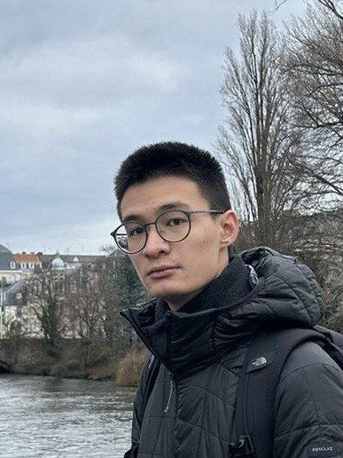

We are a team based in the [School of Computing, National University of Singapore](https://www.comp.nus.edu.sg).

You can reach us at the email `doctorwho[at]comp.nus.edu.sg`

## Project team

### Cavan Chong

[[github](https://github.com/vandalord)]
[[portfolio](team/johndoe.md)]

* Role: Team Lead

### Sebastien Leib

[[github](https://github.com/alieron)]
[[portfolio](team/alieron.md)]

* Role: Integration + QA

### Jane Doe

[[github](http://github.com/johndoe)]
[[portfolio](team/johndoe.md)]

* Role: Team Lead
* Responsibilities: UI

### Johnny Doe

[[github](http://github.com/johndoe)] [[portfolio](team/johndoe.md)]

* Role: Developer
* Responsibilities: Data

### Jean Doe

[[github](http://github.com/johndoe)]
[[portfolio](team/johndoe.md)]

* Role: Developer
* Responsibilities: Dev Ops + Threading

### Kenneth Ong

[[github](http://github.com/KenOKK3003)]
[[portfolio](team/KenOKK3003.md)]

* Role: Code Quality Lead
* Responsibilities: Ensures code quality is met at all stages of coding.

### Sara Khan 

[[github](http://github.com/s6r6k)]
[[portfolio](team/s6r6k.md)]

* Role: Developer
* Responsibilities: Documentation 
